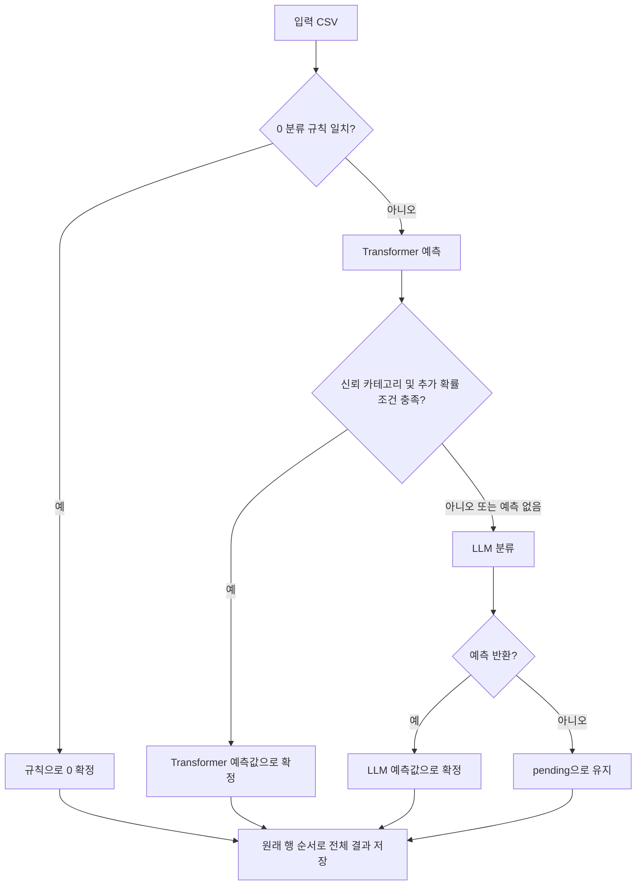

# 단계별 BIOFIN 분류 파이프라인

입력 → 규칙으로 0 확정 → 나머지를 Transformer로 예측 → 신뢰 카테고리 확정 → 나머지를 LLM으로 분류 → 원래 순서로 전체 결과 저장.

필터링은 행 삭제가 아니라 **분류를 확정하고 다음 모델의 입력에서 제외**하는 의미입니다. 원본 열과 모든 행을 보존하며 `pipeline_label`에 최종 카테고리를 기록합니다. 카테고리는 v1 기준 정수 0~9입니다.

## 처리 흐름



예를 들어 신뢰 카테고리를 `[0, 2, 5, 9]`로 설정했다면 다음과 같이 처리합니다. 이 목록은 사용자가 제시한 예시이며 실제 성능이 검증된 목록은 아닙니다.

| 입력 행 | 규칙 결과 | Transformer 예측 | 다음 처리 | 최종 분류 |
| --- | --- | --- | --- | --- |
| A | 제외 단어 일치 | 실행 대상에서 제외 | 규칙으로 확정 | 0 |
| B | 불일치 | 2 | 신뢰 카테고리로 확정 | 2 |
| C | 불일치 | 5 | 신뢰 카테고리로 확정 | 5 |
| D | 불일치 | 3 | LLM으로 전달, LLM이 7 예측 | 7 |
| E | 불일치 | 예측 없음 | LLM 미연결 또는 예측 없음 | 빈칸, pending |

## 파일 구성

| 파일 | 역할 |
| --- | --- |
| `run.py` | CSV 읽기, 설정 로딩, 파이프라인 실행, 결과 저장 |
| `core.py` | 규칙 적용, 모델별 잔여 행 전달, 확정 여부 판단, 결과 병합 |
| `config.json` | 0 분류 규칙, 신뢰 카테고리, 선택적 확률 기준 |
| `adapters.py` | 기존 Transformer 및 LLM을 연결하는 지점 |
| `test_core.py` | 단계별 라우팅, 행 보존, 미연결 처리 등의 테스트 |

## 현재 구현 범위

- 규칙 매칭, 단계별 라우팅, 최종 결과 병합, CSV 입출력 구현.
- 실제 모델 호출은 `adapters.py`에서 연결할 예정입니다. 현재 모델 로딩이나 LLM 요청은 발생하지 않습니다.
- 기본 설정은 비어 있습니다. 미연결 상태에서 분류되지 않은 행은 `pipeline_status=pending`, 최종 라벨은 빈칸입니다. 0으로 간주하지 않습니다.
- 모델이 특정 행의 예측을 반환하지 않으면 Transformer 단계에서는 LLM으로 넘기고, LLM 단계에서는 pending으로 남깁니다. 실행 예외나 잘못된 예측값은 오류로 중단합니다.

## 실행

Python 3.10 이상, 추가 패키지 없이 `budget_biodiv_cls3` 폴더에서:

```powershell
python pipeline/run.py --input open_fiscal_2024.csv --output outputs/pipeline/first_run.csv
python -m unittest discover -s pipeline -p "test_*.py"
```

기본 입력 인코딩은 UTF-8 BOM 지원입니다. 필요하면 `--encoding cp949`를 지정합니다. 기존 출력 파일은 덮어쓰지 않습니다.

다른 설정 파일을 사용하려면 `--config pipeline/my_config.json`을 추가합니다. 기본 설정 파일만 스크립트 위치를 기준으로 찾으며, 명령에 전달하는 상대 경로는 실행한 작업 폴더를 기준으로 해석합니다.

입력은 첫 행에 중복 없는 열 이름이 있는 CSV여야 합니다. 규칙에 지정한 열이 입력에 있어야 하며, 아래 결과 열과 같은 이름의 열이 이미 있으면 오류로 중단합니다. 따라서 생성된 결과 CSV를 그대로 재입력하는 재개 기능은 현재 지원하지 않습니다.

출력은 UTF-8 BOM CSV입니다. 실행 후 콘솔에는 전체 행 수와 `rule`, `transformer`, `llm`, `pending`별 행 수가 표시됩니다. 행이 없는 구분은 생략됩니다. 현재 기본 설정과 미연결 어댑터로 실행하면 모든 행이 pending으로 저장됩니다.

## 기준 설정 예시

아래는 설명용이며 검증된 기준이 아닙니다. 실제 기준이 정해지면 `config.json`에 반영합니다.

```json
{
  "zero_rules": [
    {"column": "소관명", "keyword": "제외할 소관명", "match": "exact"},
    {"column": "세부사업명", "keyword": "제외할 단어", "match": "contains"}
  ],
  "trusted_categories": [0, 2, 5, 9],
  "min_confidence": {}
}
```

규칙 중 하나라도 일치하면 0을 확정합니다. `exact`는 완전 일치, `contains`는 부분 문자열 일치이며 대소문자와 공백을 구분합니다. 규칙은 위에서부터 적용합니다.

`trusted_categories`는 평가 결과를 근거로 사람이 지정하는 카테고리 목록입니다. 행별 예측 확률과 카테고리별 정확도는 별개입니다. 필요할 때 `min_confidence`에 `{"2": 0.95}`처럼 추가하면 해당 카테고리는 예측 확률도 기준 이상이어야 확정합니다. 확률이 없으면 이 추가 조건을 통과하지 못합니다.

## 모델 연결 계약

`adapters.py`의 두 변수에 함수를 연결합니다. 함수는 남은 행의 목록을 받고 `{pipeline_row_id: Prediction(label, confidence)}`를 반환합니다. ID는 입력 행 위치로 생성한 문자열이며 해당 실행 안에서만 식별자로 사용합니다. 사업명이 중복되어도 별도 행으로 유지합니다. 모델 결과의 순서가 바뀌어도 ID로 연결합니다.

기존 Transformer/LLM v1 스크립트의 문서 매칭, 입력 전처리, 모델 경로 및 호출 옵션을 정한 후 어댑터에서 연결하면 됩니다. 기존 스크립트가 전체 파일을 읽는 방식이라면 반드시 전달받은 잔여 행만 추론하도록 연결해야 합니다.

연결 함수의 형태는 다음과 같습니다. 아래는 계약 설명용이며 `predict_one`은 실제 모델 호출로 구현해야 합니다.

```python
from core import Prediction

def classify_remaining(rows):
    predictions = {}
    for row in rows:
        label, confidence = predict_one(row)  # 실제 전처리 및 모델 호출 구현
        predictions[row["pipeline_row_id"]] = Prediction(
            label=int(label),
            confidence=confidence,
        )
    return predictions

# adapters.py에서 해당 모델 변수에 연결
transformer_predictor = classify_remaining
```

LLM도 같은 계약을 사용하며 확률이 없으면 `Prediction(label=7)`처럼 반환합니다. 반환 라벨은 Python 정수 0~9, 확률은 생략하거나 0~1이어야 합니다. 전달받지 않은 행 ID를 반환하면 오류가 발생합니다. 처리할 행이 없으면 해당 모델 함수는 호출되지 않습니다.

기존 코드 연결 후보:

- Transformer: `../transformer/v1/src/predict_attention_classifier.py`
- LLM: `../llm/v1/classify_biofin_category_with_ollama.py`

현재 계약은 상위 카테고리 0~9 기준입니다. 세부 카테고리 모델을 사용할 경우 라벨 체계와 검증 로직을 먼저 조정해야 합니다.

## 결과 열

원본 CSV의 열 뒤에 다음 열이 추가됩니다.

| 열 | 의미 |
| --- | --- |
| `pipeline_row_id` | 입력 순서에 따라 0부터 부여한 행 ID |
| `pipeline_label` | 최종 확정 카테고리. pending이면 빈칸 |
| `pipeline_source` | 최종 확정 주체: `rule`, `transformer`, `llm`. pending이면 빈칸 |
| `pipeline_status` | `classified` 또는 `pending` |
| `pipeline_reason` | 일치 규칙 또는 확정·대기 사유 |
| `pipeline_transformer_label` | Transformer의 예측 카테고리. 예측이 없으면 빈칸 |
| `pipeline_transformer_confidence` | Transformer가 반환한 확률. 없으면 빈칸 |

`pipeline_reason`에는 규칙 일치 시 `열이름:키워드`, Transformer 확정 시 `trusted_category`, LLM 확정 시 `llm_classification`이 기록됩니다. 대기 사유는 `llm_not_connected` 또는 `llm_no_prediction`입니다.

결과의 `pipeline_source`는 rule/transformer/llm, `pipeline_reason`은 분류 또는 대기 사유입니다. Transformer 예측값과 확률은 별도 열로 남아 LLM 최종 결과와 비교할 수 있습니다. 실제 데이터 추론과 정확도 검증은 아직 수행하지 않았습니다.

## 이후 정할 사항

1. 소관명·세부사업명 등에서 0으로 확정할 단어와 일치 방식.
2. 평가 데이터에서 신뢰할 Transformer 카테고리와 필요 시 확률 기준.
3. 모델 체크포인트, 문서 연결 방식, 모델별 입력 전처리.
4. LLM 모델, 프롬프트, 응답 파싱 및 예측 실패 처리.
5. 실제 데이터로 규칙 오분류, 카테고리별 성능, LLM 전달 비율 검증.

현재는 CSV 전체를 메모리에 읽고 모델별 잔여 행 목록을 한 번에 전달합니다. 모델별 배치 추론은 어댑터에서 구현해야 합니다. 체크포인트 저장, 중단 후 재개, 자동 재시도, 병렬 실행, 성능 평가 보고서는 아직 구현하지 않았습니다.


## 최근 취합 CSV와 원격 Ollama 연결

최근 정리한 CSV로 라우팅 구조만 점검하려면 `budget_biodiv_cls3`에서 실행합니다.
아래 출력 파일이 이미 있다면 새 파일명을 지정합니다.

```powershell
python pipeline/run.py --input "document/open/BIOFIN_2023_취합_2026.09.14.csv" --output "outputs/pipeline/20260914_check.csv"
```

입력의 `1차`, `하위`는 원본 열로 보존됩니다. 이 파이프라인은 정답 컬럼을
학습 필수 컬럼으로 검사하지 않습니다. 정답을 규칙이나 예측 입력으로 사용하지 않도록 합니다.
기본 규칙이 비어 있고 모델 어댑터가 `None`이므로 위 실행은 모든 행을 pending으로 남깁니다.

현재 `run.py`에는 `--ollama-url`이나 `--model` 옵션이 없습니다.
공용 Ollama URL을 `config.json`에 넣는 것만으로 LLM 연결이 완성되지 않습니다.
`adapters.py`에 남은 행만 처리하는 호출을 구현하고 서버 주소·모델·캐시 정책을 연결해야 합니다.
실제 모델을 먼저 따로 시험할 때는 [LLM v1 안내](../llm/v1/README.md)를 사용합니다.
원격 접속정보와 이용 조건은 [LLM 공통 안내](../llm/README.md)에 있습니다.

Transformer 정답 컬럼명 설정은 [v1 안내](../transformer/v1/README.md),
프로젝트 입력 구성은 [상위 README](../README.md)를 참고합니다.
